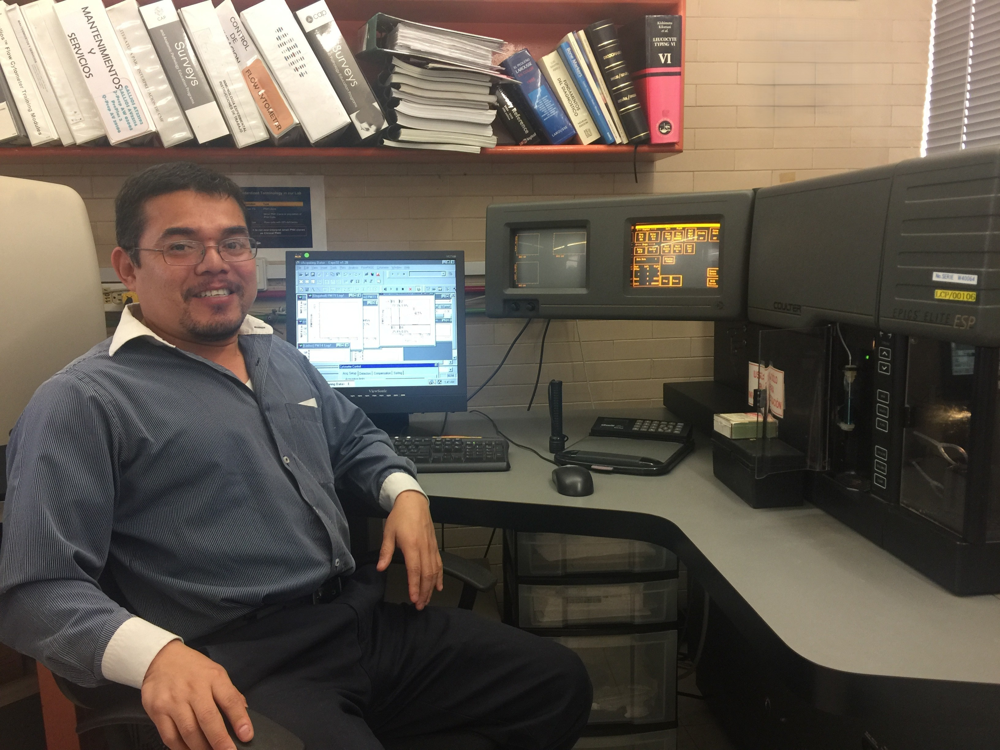

# Acerca del Autor {.unnumbered}

{fig-align="center"}

El autor es Médico Cirujano por la Universidad Autónoma de Yucatán ([UADY](https://uady.mx/)). Posteriormente, realizó estudios de posgrado en el Centro de Investigación y de Estudios Avanzados del Instituto Politécnico Nacional ([CINVESTAV-IPN](https://www.cinvestav.mx/conocenos/bienvenida)), sede Zacatenco, en la Ciudad de México, donde obtuvo los grados de Maestría y Doctorado en Ciencias con especialidad en Genética y Biología Molecular.

Durante su formación de posgrado incursionó de manera paralela en bioinformática y citometría de flujo, áreas que marcarían de forma decisiva su trayectoria profesional. En bioinformática trabajó en análisis de secuencias génicas utilizando entornos UNIX y el lenguaje Perl, incluyendo búsquedas con BLAST y diseño de *primers*. De manera simultánea, desarrolló experiencia en citometría de flujo aplicada al análisis del ciclo celular, integrando herramientas computacionales con aproximaciones experimentales para el estudio de procesos biológicos complejos. Actualmente complementa esta línea de trabajo mediante el uso de los lenguajes de programación R y Python para el análisis, procesamiento y visualización de datos biológicos.

Tras concluir el doctorado, se desempeñó como asesor científico comercial en una empresa líder en el desarrollo y comercialización de citómetros de flujo, experiencia que le permitió adquirir un conocimiento profundo de la instrumentación, sus fundamentos físicos y ópticos, así como sus aplicaciones en investigación biomédica y diagnóstico clínico.

Actualmente es académico del programa Investigadores por México de la Secretaría de Ciencia, Humanidades, Tecnología e Innovación ([SECIHTI](https://secihti.mx/)), comisionado al Hospital de Alta Especialidad de la Península de Yucatán ([HRAEPY](https://www.gob.mx/salud%7Chraepy)) del IMSS-BIENESTAR. Además, es profesor del capítulo de Citometría de Flujo de la Sociedad Mexicana de Inmunología ([SMI](https://sociedadmexicanadeinmunologia.org/)), donde participa activamente en la formación de especialistas mediante la impartición de talleres y cursos sobre fundamentos, diseño experimental y análisis avanzado de datos en citometría de flujo.
