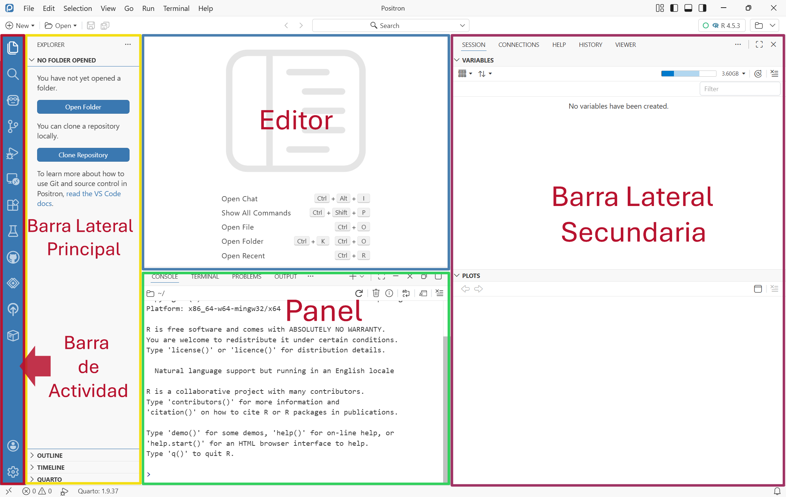

# R & LA IDE

[R](https://www.r-project.org/) es un lenguaje de programación y un entorno de software libre (código abierto) especializado en computación estadística, análisis de datos y gráficos. En el campo de la bioinformática, R se ha convertido en uno de los estándares fundamentales de la industria y la investigación científica.

- **Enfoque analítico**: Fue diseñado específicamente por y para estadísticos, investigadores y científicos de datos.

- **Ecosistema de paquetes**: Cuenta con miles de [librerías](https://cran.r-project.org/web/packages/available_packages_by_name.html) adicionales que permiten desde análisis genómicos complejos hasta la manipulación de millones de eventos celulares.

- **Comunidad**: Posee una comunidad científica y académica global muy activa que constantemente desarrolla nuevas metodologías y herramientas de código abierto

:::{.callout-note}
En **citometría de flujo**, R se utiliza como un entorno integral para sustituir o complementar los programas comerciales tradicionales, permitiendo automatizar análisis, procesar decenas de archivos .fcs en lote de forma reproducible y aplicar algoritmos de alta dimensión.
:::

## ¿**Por qué usar R en lugar de software manual**?

- **Automatización y escalabilidad**: Un análisis manual en interfaces visuales requiere trazar compuertas (gates) muestra por muestra. En R, una rutina procesa cientos de archivos en minutos con los mismos parámetros exactos.

- **Control de sesgo**: Las compuertas algorítmicas y estadísticas reducen la variabilidad inter-operador típica del gating manual.

- **Manejo de citometría multiparamétrica**: En paneles modernos de más de 20 a 50 parámetros (como en citometría espectral o CyTOF/citometría de masas), el análisis bivariado clásico es insuficiente. R aporta algoritmos de reducción de dimensionalidad y agrupamiento no supervisado.

# POSITRON

El análisis de datos masivos provenientes de la citometría de flujo requiere no solo de algoritmos robustos, sino de una infraestructura de software que optimice el flujo de trabajo del científico. Aunque históricamente RStudio ha sido el estándar de oro para la comunidad de R, el panorama tecnológico actual exige herramientas más versátiles, veloces y capaces de integrar flujos de trabajo políglotas. Aquí es donde surge Positron.

[Positron](https://positron.posit.co/) es un entorno de desarrollo integrado (IDE) gratuito y de última generación diseñado específicamente para la ciencia de datos. Desarrollado por [Posit](https://posit.co/), este entorno representa la evolución natural de las herramientas de programación científica, facilitando un trabajo fluido y nativo tanto en R como en Python.

## Arquitectura moderna en ciencia de datos 

A diferencia de otros editores genéricos, Positron no nace desde cero, sino que combina de manera fluida lo mejor de dos mundos. Por un lado, al haber sido construido como una rama de *Visual Studio Code*, hereda de inmediato la potencia de su arquitectura: una interfaz de codificación ultramoderna, un rendimiento de memoria excepcionalmente veloz y acceso a un ecosistema masivo de extensiones y personalización avanzada. Por el otro, el equipo de Posit ha inyectado en esta estructura toda la experiencia acumulada durante más de una década creando y manteniendo RStudio. El resultado no es un simple editor de texto general al que se le añaden complementos, sino un entorno diseñado desde su núcleo por y para científicos de datos.

Al trabajar en la automatización de los análisis citométricos, Positron ofrece funciones críticas orientadas a mejorar la reproducibilidad y la velocidad de ejecución:

- **Explorador de Datos Integrado**: Permite inspeccionar *data frames*, matrices y estructuras complejas de manera visual y de alto rendimiento, ideal para verificar las dimensiones de las matrices de expresión celular o metadatos de archivos FCS.

- **Gestión Inteligente de Intérpretes**: Permite cambiar entre diferentes versiones de R o entornos virtuales de Python con un solo clic, garantizando que los proyectos de Bioconductor utilicen siempre las dependencias correctas.

- **Asistencia de IA Nativa**: Ayuda a depurar *scripts*, optimizar *bucles* de análisis o autocompletar código de gráficos complejos rápidamente.

## Anatomía del entorno de trabajo en Positron

La interfaz de Positron ha sido meticulosamente estructurada para maximizar la eficiencia en el análisis de datos. Si se viene de entornos tradicionales como RStudio o VS Code, se notará un diseño familiar pero profundamente optimizado para flujos de trabajo científicos.

Los componentes principales que gobiernan este IDE se dividen en cinco zonas ([Figura 1](#fig-1)) clave:

- **Barra de Actividad** (***Activity Bar***): Ubicada habitualmente en el extremo lateral, funciona como el centro de control global del IDE. Proporciona acceso inmediato a módulos esenciales como el Explorador de archivos, el motor de Búsqueda indexada, el sistema de Control de Versiones (Git), la gestión de Extensiones y las configuraciones del sistema.

- **Barra Lateral Principal** (***Primary Side Bar***): Este panel dinámico muta su contenido según el módulo activo en la Barra de Actividad. Por ejemplo, al activar la vista de gestión de archivos, se despliega aquí un árbol de directorios interactivo para navegar por las carpetas del proyecto.

- **Editor de Código** (***Editor***): El núcleo operativo de la interfaz. Es el área de alta velocidad destinada a la escritura de scripts de R, archivos Quarto (`.qmd`) o código Python, equipado con autocompletado inteligente, resaltado de sintaxis y asistencia en tiempo real.

- **Panel Central Inferior** (***Console & Terminal***): La zona de ejecución interactiva. Aloja las consolas nativas de programación (donde se interpretan y devuelven los comandos de R o Python de forma inmediata) y la Terminal del sistema operativo para tareas de administración del entorno.

- **Barra Lateral Secundaria** (***Secondary Side Bar***): La innovación analítica de Positron. Este panel está dedicado exclusivamente a la inspección de la ciencia de datos en ejecución: aquí se auditan las variables cargadas en el entorno (***Environment***), se previsualizan los gráficos generados, se consulta la documentación técnica de las funciones y se interactúa con el Explorador de Datos integrado.

::: {style="text-align: center;"}

**Figura 1**. Entorno de trabajo Positron
:::

# ACTIVIDADES DE APRENDIZAJE

---

  Hecho con 💙 por Jairo

